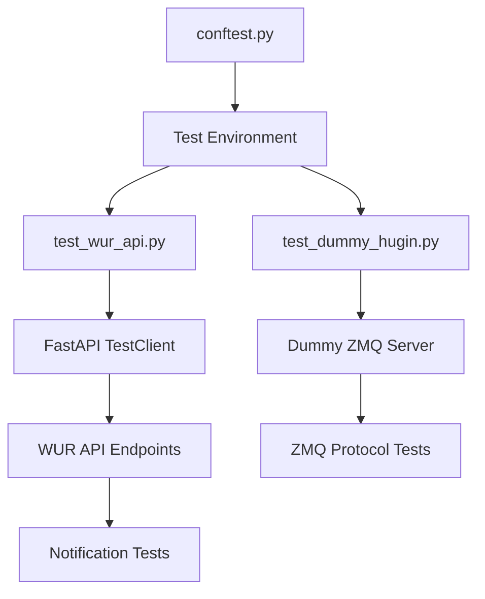

# 🧪 Testing the WUR API and Hugin Interface

<div align="center">
  
  
  
</div>

This directory contains comprehensive tests for both the WUR API and the Hugin ZMQ interface. These tests validate the correct functionality of all components, individually and when integrated.

## 🚀 Running Tests

<table>
<tr>
<td>Run all tests</td>
<td>

```bash
pytest
```
</td>
</tr>
<tr>
<td>Run API tests</td>
<td>

```bash
pytest tests/test_wur_api.py
```
</td>
</tr>
<tr>
<td>Run dummy server tests</td>
<td>

```bash
pytest tests/test_dummy_hugin.py
```
</td>
</tr>
<tr>
<td>Verbose output</td>
<td>

```bash
pytest -v
```
</td>
</tr>
<tr>
<td>With coverage report</td>
<td>

```bash
pytest --cov=wur_api
```
</td>
</tr>
</table>

## 🏗️ Test Architecture



## 📋 Test Categories

### WUR API Tests (`test_wur_api.py`)

| Category | Tests |
|----------|-------|
| API Endpoints | Tests all REST endpoints defined in the OpenAPI spec |
| Response Formats | Validates response structures and message types |
| API Flow | Tests complete API workflow sequences |
| Error Handling | Tests API error responses and recovery |
| Notifications | Tests registration and delivery of notifications |

### Dummy Hugin Tests (`test_dummy_hugin.py`)

| Category | Tests |
|----------|-------|
| Server Lifecycle | Tests server start/stop operations |
| ZMQ Communication | Tests message sending and receiving |
| Response Format | Validates ZMQ response structure |
| Error Simulation | Tests simulated error conditions |
| Concurrency | Tests handling of concurrent requests |

## 🛠️ Testing Tools

The tests use several fixtures defined in `conftest.py`:

- **`api_client`**: FastAPI test client for making HTTP requests
- **`dummy_hugin`**: Dummy ZMQ server for simulating Hugin
- **`test_env`**: Environment variables for isolated testing
- **`notification_server`**: Mock server for testing notifications
- **`event_loop`**: Shared event loop for async tests

## 📝 Writing New Tests

When adding new tests:

1. **Use existing fixtures** for consistent test environments
2. **Test both success and failure cases**
3. **Clean up resources** after tests complete
4. Use **`@pytest.mark.asyncio`** for asynchronous tests
5. Consider **parameterizing tests** for testing multiple cases
6. Add **meaningful assertions** that validate behavior, not implementation

## 🔍 Test Coverage

Current test coverage targets:
- **API Endpoints**: 100% coverage
- **ZMQ Client**: 95% coverage  
- **Dummy Hugin**: 90% coverage
- **Error Conditions**: 85% coverage

Run `pytest --cov=wur_api --cov-report=html tests/` to generate a detailed HTML coverage report.